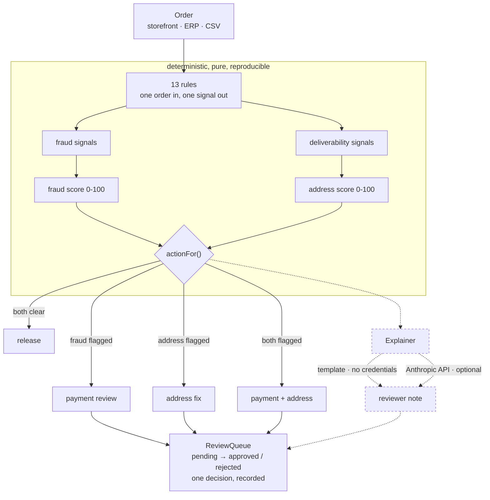

# order-risk-agent

Score an order for fraud and for deliverability as two separate numbers, let an LLM write the note, and never let it make the call.

Deterministic rules decide; the model only explains. Runs on bundled fixtures with no credentials and no network.

```
npm install && npm run demo
```

## Why this exists

I run fulfilment for two live storefronts. The orders that cost me money fall into two piles that look identical in a dashboard and need completely different people.

One pile is payment risk: a card that will be charged back, six orders in an hour from a throwaway address. The other pile is address data that will fail at the carrier: a postcode sitting in the city column, a street with no house number, `Germany` arriving in a field typed as a two-letter code. I have fixed all three of those by hand, on live orders, after a label had already failed.

Most risk scoring collapses both into one "risk score". That is how a customer who has ordered from you eleven times and typed their postcode wrong ends up in a fraud review, and how a genuinely stolen card ends up behind a queue of address typos. So this scores them separately and routes them separately.

The second thing: the obvious way to build this in 2026 is to hand the order to an LLM and ask whether it looks risky. I did not, and the reason is in the design decisions below.

## Architecture



The dashed path is the LLM. Note that it hangs off the end and nothing returns from it into the decision.

## Quick start

```bash
git clone https://github.com/krunalp2801/order-risk-agent
cd order-risk-agent
npm install
npm test      # 95 tests, no credentials needed
npm run demo  # assesses 9 fixture orders and works the queue
```

The demo prints the routing table, the queue worst-first with each reviewer note, and then has a reviewer reject the card-testing order and approve the cross-border gift, because approving a flagged order is a normal outcome.

```
order    fraud  addr  routed to          top signal
#1001        0     0  release            -
#1002        0    90  address fix        malformed_postcode
#1003        0    65  address fix        missing_street_number
#1004      100    67  payment + address  disposable_email
#1005       50     0  payment review     billing_shipping_country_mismatch
#1006       55     0  payment review     prior_chargeback
#1007       14    22  release            missing_phone_for_expedited
#1008        0    45  address fix        malformed_postcode
#1009       60     0  payment review     high_value_first_order
```

#### Turn the LLM on

Copy `.env.example` to `.env` and set `ANTHROPIC_API_KEY`. The notes get better. The scores do not move, and `test/explain.test.ts` asserts exactly that.

### Use it as a library

```ts
import { assess, ReviewQueue, resolveExplainer } from "order-risk-agent";

const queue = new ReviewQueue();
const assessment = await assess(order, { explainer: resolveExplainer(process.env) });
queue.enqueue(assessment);          // null when the order was released

for (const item of queue.pending()) {   // worst first
  console.log(item.assessment.explanation);
}
queue.approve(orderId, "cs@shop.example", "Confirmed by phone.");
```

### The rules

| Rule | Kind | Weight |
|---|---|---|
| `prior_chargeback` | fraud | 55 |
| `disposable_email` | fraud | 55 |
| `billing_shipping_country_mismatch` | fraud | 30 |
| `order_velocity` | fraud | 20–44 |
| `high_value_first_order` | fraud | 20–30 |
| `pickup_point_high_value` | fraud | 18 |
| `quantity_outlier` | fraud | 14 |
| `expedited_first_order` | fraud | 12 |
| `malformed_postcode` | deliverability | 45 |
| `postcode_city_swapped` | deliverability | 45 |
| `missing_street_number` | deliverability | 40 |
| `country_code_not_iso` | deliverability | 25 |
| `missing_phone_for_expedited` | deliverability | 22 |

Every rule carries a `rationale` string in the code saying why it exists. Review at 25, hold at 55, both overridable.

## Design decisions

**The LLM explains, the rules decide.** The two jobs have different failure costs. A wrong score routes an order to the wrong team and a customer waits a day. A wrong sentence wastes ten seconds of a reviewer's time. Only the second is safe to give to something that cannot show its work and will not give the same answer twice. So the explainer sits at the end of the pipeline, receives the scores as input, and returns a string that nothing reads back. `test/explain.test.ts` runs the same order through the template explainer and through a hostile explainer that insists the order is fine, and asserts the scores, the signals and the routing come out byte-identical.

This also means the thing a compliance conversation needs — *why was this order held?* — has an answer that is a list of rules and weights, not a prompt and a sampling temperature.

**Two scores, not one.** The split is the whole point and it is the part I would argue for hardest. Fraud and deliverability have different reviewers, different fixes, different costs and no correlation worth modelling. A loyal customer with a typo and a stolen card are both "risky" only in a sense too abstract to act on.

**No action refuses an order.** The four outcomes are release, payment review, address fix, and both. There is no cancel, no refund, no block — not as a missing feature but as a constraint, and `score.test.ts` asserts the set of reachable actions to keep it that way. Automatically refusing a customer's order carries a legal and reputational cost that belongs to a human whose job it is. This is the same line week 1 drew: [shopify-mcp-server](https://github.com/krunalp2801/shopify-mcp-server) can read a store and cannot write to it.

**Rules are pure functions of one order.** No database calls, no clock, no network. That is what makes a score reproducible a month later, lets a reviewer be shown exactly which rules fired, and lets a new rule be re-run over historical orders to see what it *would* have done before it goes live. Customer history arrives pre-aggregated as counts for the same reason: a rule cannot go and query something mid-evaluation if it has nothing to query with.

**Weights are summed, not combined probabilistically.** A Bayesian combination would imply these are calibrated likelihoods on independent signals. They are hand-set integers reflecting how much each finding should matter, and dressing that up as probability would make it look more trustworthy than it is. Two weights are set to reach the hold threshold alone, on purpose: a prior chargeback and a confirmed disposable domain.

**The queue refuses a second decision.** Deciding an already-decided item throws `AlreadyDecidedError` rather than overwriting. Re-assessing an order updates a pending item in place but will not resurrect a decided one, so a reviewer's approval stands even if the rules later score it higher.

### Trade-offs

- **In-memory queue.** The interesting part of a review queue is the state machine, not the storage, so the storage is a `Map`. Postgres is a `ReviewStore` interface away and would not change a single test in `queue.test.ts`.
- **Postcode formats cover 17 countries.** Anything else is skipped rather than guessed. Calling a valid Brazilian postcode malformed is worse than not checking it.
- **The disposable-domain list is short and hardcoded.** A "looks disposable" heuristic false-positives on every small company running its own mail server. A boring list is the right amount of cleverness, and it wants a feed rather than a better algorithm.
- **`assessAll` is sequential.** With the LLM explainer, a few hundred orders fired at once is a rate-limit incident. Concurrency belongs behind a limiter, which is not built rather than faked.
- **A velocity count of 3 is a guess.** It is right for my stores and wrong for a flash-sale brand. Every threshold here wants calibrating against one merchant's actual chargeback history, and the honest version of this project ships with a backtest, which is the next thing on the list.

## What is next

- A backtest command: run a rule set over a historical order export and report what it would have flagged against what actually charged back. Without this, every weight in the table above is an opinion.
- `ReviewStore` interface with a Postgres implementation, and the queue's state transitions as the audit trail.
- Adapters at the edge: `fromShopifyOrder`, so the domain model stays Shopify-shaped at one boundary only.
- Address auto-repair for the cases that are unambiguous. A postcode and city that are simply swapped can be swapped back; I do it by hand today and it is the single most common fix.
- A concurrency limiter so `assessAll` can run a backlog without tripping the API.

## Development

```bash
npm test          # typecheck + 95 tests
npm run typecheck
npm run build
npm run demo
```

Tests run straight from the TypeScript sources via Node's type stripping, so
**development needs Node 22.6+**, and the source avoids TypeScript syntax that
needs a real transform — notably parameter properties.

The built output is plain JavaScript and runs on **Node 20+**. CI proves both
separately: tests on 22 and 24, and a build-plus-demo job on 20. Zero runtime
dependencies; the optional Anthropic call is a `fetch`.

MIT licensed.

---

Built by Krunal Patel, part of the Weekly Build series. More at https://www.krunal.de
